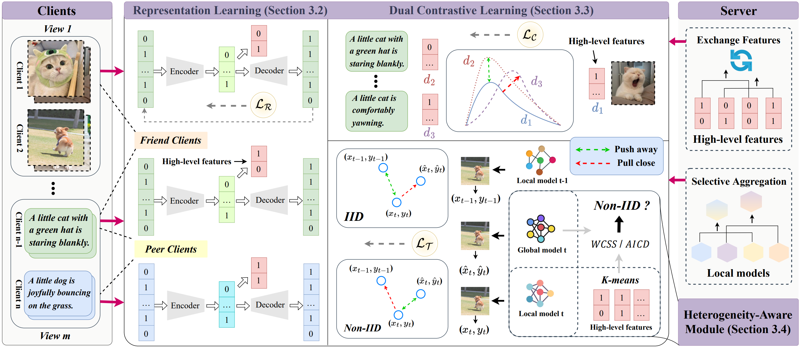

# Code for HFMVC


### The official code for

### [Heterogeneity-Aware Federated Deep Multi-View Clustering towards Diverse Feature Representations](https://openreview.net/forum?id=3fgY4qOhoO)  ( ACM MM 24 )





To start training a model on provided datasets, e.g., BDGP, run:

```python
python HFMVC.py
```


##### Please note that the number of clients (or different datasets) may require adjustments to the corresponding *args.lbda.*


The *args.main_epochs* determines the termination point of training.


The *args.interval*_epoch dictates the communication frequency between clients and the server.


The *args.Dirichlet*_alpha parameter influences the partitioning of the dataset across different clients.


Generally, these parameters are relatively sensitive and require tuning.


If you have any questions, please feel free to email us at xrjiang@mail.ustc.edu.cn.


We will assist you as soon as possible.


If you find this work useful, please consider citing it:


```
@inproceedings{jiang2024heterogeneity,
  title={Heterogeneity-Aware Federated Deep Multi-View Clustering towards Diverse Feature Representations},
  author={Jiang, Xiaorui and Ma, Zhongyi and Fu, Yulin and Liao, Yong and Zhou, Pengyuan},
  booktitle={ACM Multimedia 2024},
  year={2024}
}
```


**We are open to discussions in various forms and welcome your engagement!**


